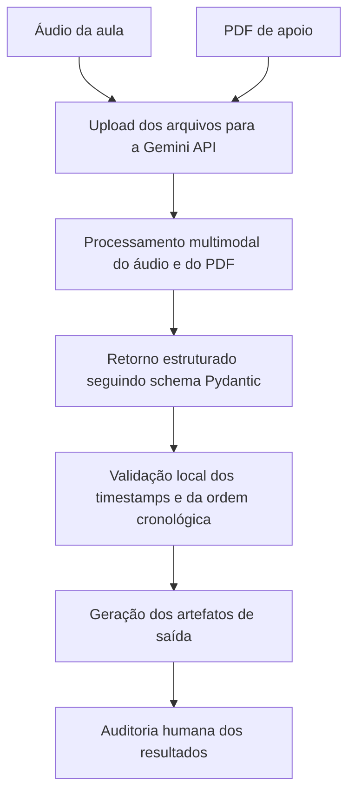
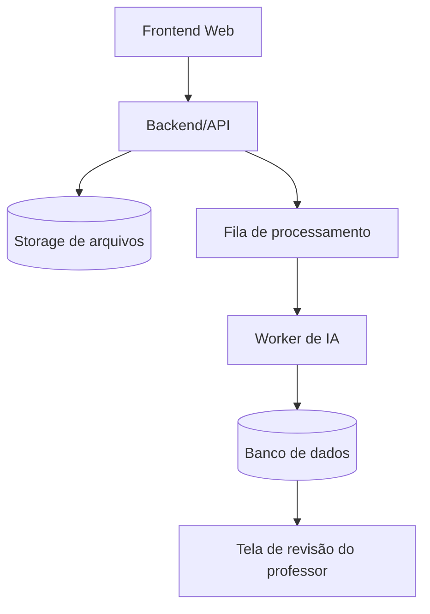

# Arquitetura da POC

## Visão Geral

Esta POC tem como objetivo validar um motor de inteligência artificial capaz de receber um áudio de aula e um material de apoio em PDF, processar os dois arquivos de forma multimodal e gerar uma saída estruturada com tópicos, timestamps, resumo da aula, conceitos principais, páginas relacionadas do PDF e nível de confiança da correlação.

Nesta fase, o sistema ainda não possui interface web, login, banco de dados ou deploy em servidor. Todo o processamento será executado localmente por meio de um script Python.

## Fluxo Geral



## Entradas do Sistema

Os arquivos de entrada devem ser colocados manualmente na pasta `input/`.

```text
input/
  aula_teste.mp3
  material_teste.pdf
```

### Áudio da Aula

Arquivo contendo a gravação da aula a ser analisada.

Formato inicial recomendado: `.mp3`

### PDF de Apoio

Arquivo contendo o material de leitura relacionado à aula.

Formato inicial recomendado: `.pdf`

## Processamento

O processamento será realizado pelo script `src/poc_motor_final.py`.

O script executa as seguintes etapas:

1. Verifica se a variável de ambiente `GEMINI_API_KEY` está configurada.
2. Envia o áudio e o PDF para a Gemini API.
3. Aguarda o processamento dos arquivos com controle de estados (`ACTIVE`, `FAILED`) e timeout.
4. Solicita ao modelo uma análise estruturada.
5. Recebe a resposta no formato definido pelo schema Pydantic.
6. Valida os timestamps gerados.
7. Confere se `tempo_fim` é maior que `tempo_inicio`.
8. Gera os arquivos de saída para auditoria.

## Componentes Técnicos

### Gemini API

Responsável por realizar a análise multimodal do áudio e do PDF.

### Pydantic

Responsável por definir o formato esperado da resposta da IA e restringir os campos retornados.

### Schema de Saída

O motor deve retornar uma lista de tópicos contendo:

```text
titulo
tempo_inicio
tempo_fim
resumo_aula
conceitos_principais
pagina_pdf
trecho_pdf
confianca
observacao
```

### Validações Locais

Mesmo com o uso de IA, algumas validações são feitas localmente pelo Python:

* Formato do timestamp deve seguir `HH:MM:SS`;
* Minutos e segundos devem ser menores que 60;
* `tempo_fim` deve ser maior que `tempo_inicio`;
* `confianca` deve aceitar apenas `alta`, `media` ou `nenhuma`.

## Saídas do Sistema

Os arquivos gerados serão salvos na pasta `output/`.

```text
output/
  resultado_aula.json
  resultado_aula.md
  validacao_manual.csv
  README_VALIDACAO.txt
```

### `resultado_aula.json`

Arquivo estruturado com os dados brutos retornados pela IA.

### `resultado_aula.md`

Relatório legível em Markdown para leitura rápida do resultado.

### `validacao_manual.csv`

Planilha usada para auditoria humana dos timestamps, páginas e trechos citados.

### `README_VALIDACAO.txt`

Arquivo com instruções para orientar a validação manual.

## Regras Técnicas

* O campo `pagina_pdf` deve representar a página sequencial do arquivo PDF, considerando a primeira página do arquivo como página 1.
* O campo `trecho_pdf` só deve ser preenchido quando o trecho existir literalmente no PDF enviado.
* Caso não exista correspondência direta no PDF, o motor deve retornar:
  * `pagina_pdf = null`
  * `trecho_pdf = null`
  * `confianca = "nenhuma"`
* Para correspondência conceitual, mas não literal, o motor deve usar:
  * `confianca = "media"`
  * Explicação no campo `observacao`
* O motor não deve inventar páginas, trechos ou referências.

## Limitações Conhecidas

Esta POC ainda depende da capacidade do modelo de interpretar corretamente o áudio e o PDF. Portanto, os resultados não devem ser considerados automaticamente confiáveis.

A validação humana é obrigatória nesta fase.

Principais riscos conhecidos:

* Timestamps aproximados;
* Página do PDF incorreta;
* Trecho citado de forma imprecisa;
* Correspondência conceitual tratada como literal;
* Ausência de referência marcada incorretamente como correspondência.

## Evolução Futura

Após validação da POC, a arquitetura poderá evoluir para:



Possíveis melhorias futuras:

* Extração prévia do PDF por página;
* Busca semântica com embeddings;
* Banco vetorial;
* API com FastAPI;
* Interface web para upload;
* Tela de revisão docente;
* Armazenamento em banco de dados;
* Controle de usuários.
